# TSDB 架构可视化文档

> 使用 Mermaid 语法，可在 GitHub / VS Code / IntelliJ 中直接渲染

---

## 1. 系统架构图 (System Architecture)

```mermaid
flowchart TB
    subgraph Client["客户端层"]
        CLI["tsdb-cli 命令行工具"]
        HTTP_CLIENT["HTTP Client REST API"]
        TCP_CLIENT["TCP Client 二进制协议V2"]
    end

    subgraph Server["服务层 tsdb-server"]
        HTTP_API["HTTP API warp框架<br/>/api/v1/write /api/v1/query /api/v1/timeseries"]
        TCP_HANDLER["TCP Handler NNG传输 Envelope V2"]
        PROTOCOL["Protocol V2 Envelope CRC32 Request Response MessagePack"]
        TSDB_SERVER["TsdbServer 请求路由"]
    end

    subgraph Query["查询引擎 tsdb-query"]
        PARSER["SqlParser SQL to AST"]
        PLANNER["QueryPlanner AST to ExecutionPlan"]
        QENGINE["QueryEngine 执行引擎"]
        VEC_ENGINE["VectorizedEngine 列式计算"]
        SIMD_AGG["SimdAggregator 聚合函数"]
        COL_BATCH["ColumnarBatch 列式存储"]
    end

    subgraph Aggregate["聚合管道 tsdb-aggregate"]
        PIPELINE["LightAggregationPipeline 内存缓冲 定时刷盘"]
        AGGREGATOR["Aggregator 分桶累加"]
        WORKER["Worker NNG消费者"]
        AGG_STORE["AggregationStore RocksDB持久化"]
        TS_GEN["TimeseriesGenerator 趋势 对比 多维"]
        STORE_MGR["AggregationStoreManager 多业务管理"]
    end

    subgraph Core["存储引擎 tsdb-core"]
        ENGINE["StorageEngine 读写入口"]
        MULTI_DB["MultiDbManager 多数据库管理"]
        CF_MGR["CfManager 按日期CF管理 HOT COLD分层"]
        BLOCK_WRITER["BlockWriter 块缓冲写入"]
        DIM_TABLE["DimensionTable Tag维度编码"]
        MERGE_OP["MergeOperator MergedBlock合并"]
        ROWKEY["RowKey Qualifier 键编码"]
    end

    subgraph Index["索引层 tsdb-index"]
        IDX_MGR["IndexManager 时间 标签索引"]
        SKIPLIST["SkipList 时间范围索引 Ologn"]
        INV_IDX["InvertedIndex 倒排索引 RoaringBitmap"]
        WAL["IndexWAL 预写日志"]
    end

    subgraph Compress["压缩层 tsdb-compress"]
        CODEC["BlockCodec 块级编解码"]
        GORILLA["GorillaEncoder 浮点XOR压缩"]
        DELTA["DeltaEncoder 时间戳Delta压缩"]
        DICT["DictionaryEncoder 字符串字典编码"]
    end

    subgraph Storage["持久化层"]
        ROCKSDB["RocksDB LSM Tree 引擎"]
        AGG_ROCKSDB["RocksDB 聚合数据实例"]
    end

    subgraph Viz["可视化层"]
        CHART["tsdb-chart TimeSeriesChart SvgRenderer"]
        DASHBOARD["tsdb-dashboard Business Performance DashboardRenderer"]
    end

    CLI --> HTTP_API
    CLI --> TCP_HANDLER
    HTTP_CLIENT --> HTTP_API
    TCP_CLIENT --> TCP_HANDLER

    HTTP_API --> TSDB_SERVER
    TCP_HANDLER --> PROTOCOL
    PROTOCOL --> TSDB_SERVER

    TSDB_SERVER --> QENGINE
    TSDB_SERVER --> ENGINE
    TSDB_SERVER --> PIPELINE
    TSDB_SERVER --> MULTI_DB

    QENGINE --> PARSER
    QENGINE --> PLANNER
    QENGINE --> VEC_ENGINE
    VEC_ENGINE --> SIMD_AGG
    VEC_ENGINE --> COL_BATCH

    PIPELINE --> AGGREGATOR
    PIPELINE --> STORE_MGR
    WORKER --> AGGREGATOR
    AGGREGATOR --> AGG_STORE
    AGG_STORE --> AGG_ROCKSDB
    TS_GEN --> AGG_STORE
    TS_GEN --> CHART

    ENGINE --> CF_MGR
    ENGINE --> BLOCK_WRITER
    ENGINE --> DIM_TABLE
    ENGINE --> IDX_MGR
    ENGINE --> CODEC
    ENGINE --> ROWKEY
    ENGINE --> MERGE_OP
    MULTI_DB --> ENGINE

    IDX_MGR --> SKIPLIST
    IDX_MGR --> INV_IDX
    IDX_MGR --> WAL

    CODEC --> GORILLA
    CODEC --> DELTA
    CODEC --> DICT

    ENGINE --> ROCKSDB

    DASHBOARD --> QENGINE
    DASHBOARD --> CHART
```

---

## 2. Crate 依赖层次图 (Dependency Layers)

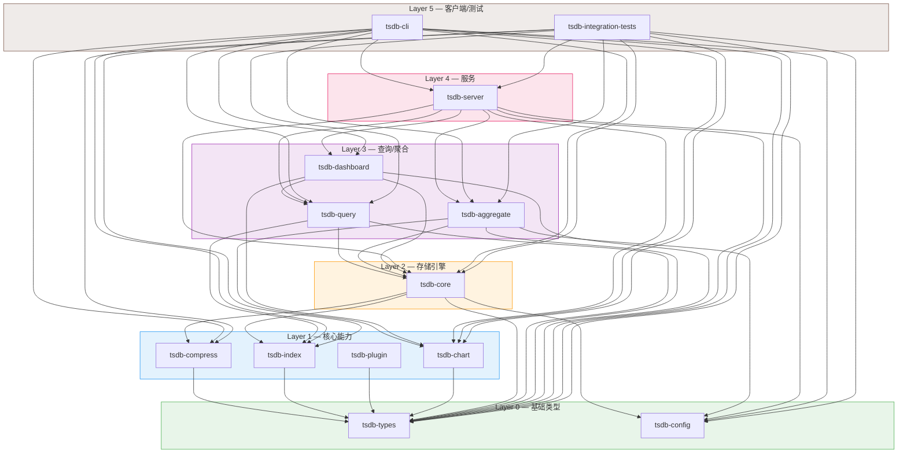

---

## 3. 核心数据模型类图 (Class Diagram)

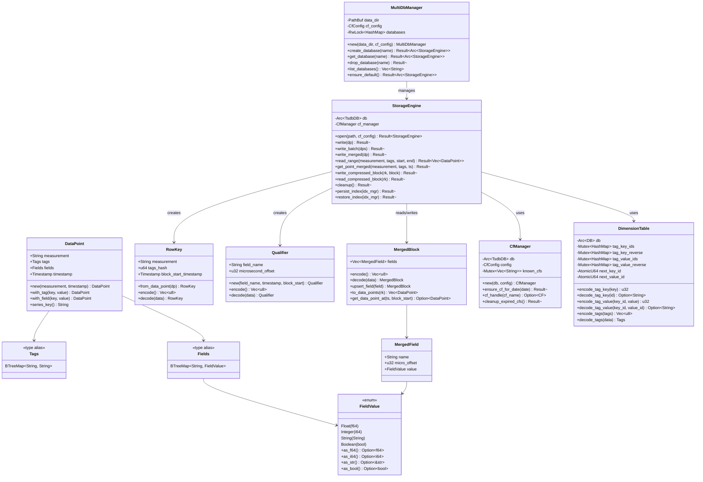

---

## 4. 索引层类图 (Index Layer Class Diagram)

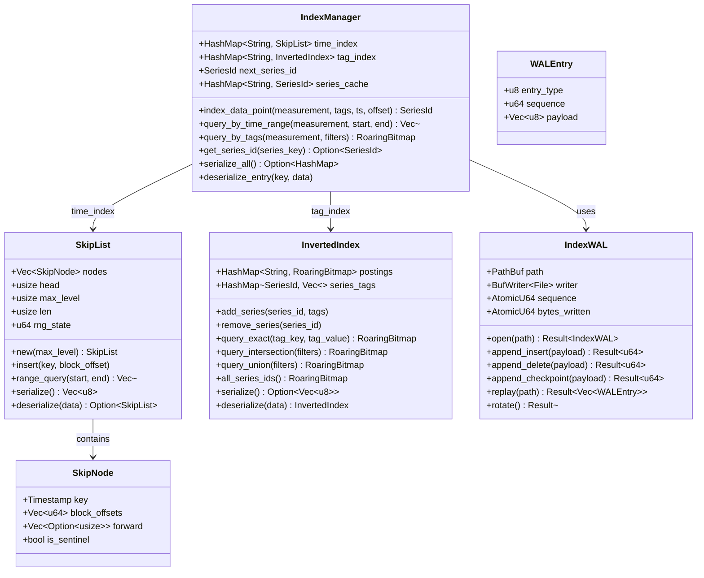

---

## 5. 写入路径时序图 (Write Path Sequence Diagram)

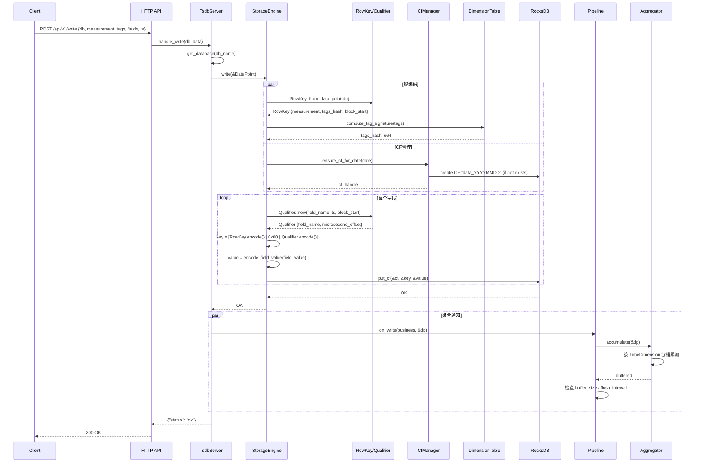

---

## 6. Merge 写入路径时序图 (Merge Write Path)

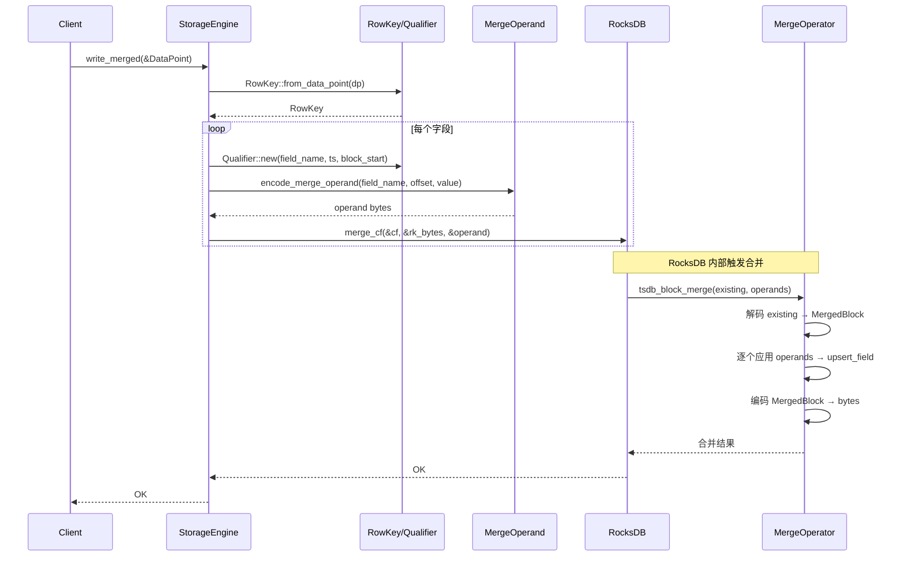

---

## 7. 查询路径时序图 (Query Path Sequence Diagram)

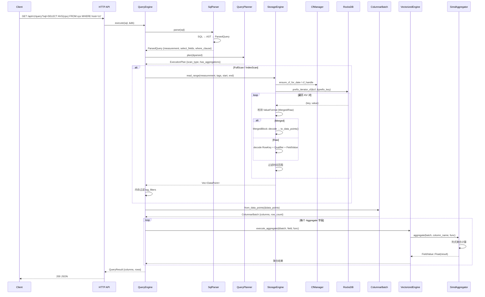

---

## 8. 聚合管道时序图 (Aggregation Pipeline Sequence Diagram)

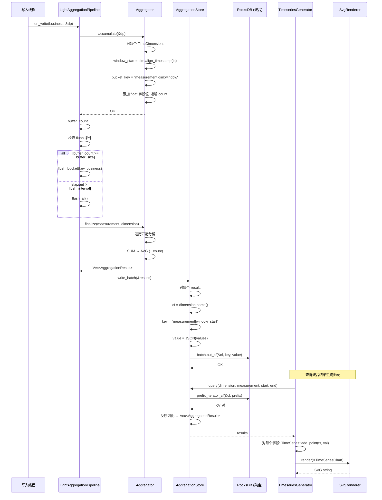

---

## 9. 存储引擎组件图 (Storage Engine Component Diagram)

```mermaid
flowchart TB
    subgraph API["StorageEngine 公开API"]
        WRITE["write / write_batch"]
        WRITE_M["write_merged / write_merged_batch"]
        READ["read_range"]
        READ_M["get_point_merged"]
        COMP_W["write_compressed_block"]
        COMP_R["read_compressed_block / read_range_compressed"]
        CLEANUP["cleanup"]
        PERSIST["persist_index / restore_index"]
    end

    subgraph KeyEnc["键编码层"]
        RK["RowKey<br/>measurement | tags_hash 8B | block_start 8B"]
        Q["Qualifier<br/>field_name : offset 4B"]
        RK -->|0x00 分隔符| Q
    end

    subgraph ValFmt["值格式"]
        RAW["Raw 格式 type 1B | payload"]
        MERGED["MergedBlock 格式<br/>0xFEED magic | field_count | MergedField数组"]
        COMPRESSED["CompressedBlock 格式<br/>bincode 序列化 DataBlock"]
    end

    subgraph CFLayout["Column Family 布局"]
        META_CF["metadata CF 索引和元数据"]
        HOT_CF["data_YYYYMMDD HOT CF 0到7天 WriteBufferManager"]
        COLD_CF["data_YYYYMMDD COLD CF 8到30天 ZSTD压缩"]
    end

    subgraph MergePath["Merge 写入路径"]
        MO["MergeOperand field_name offset value"]
        MOP["tsdb_block_merge 合并同一RowKey字段"]
        MB_OUT["MergedBlock 多字段打包存储"]
    end

    subgraph CompressPath["压缩路径"]
        CODEC["BlockCodec 块级编解码"]
        GORILLA["GorillaEncoder float XOR 压缩比5到15倍"]
        DELTA["DeltaEncoder timestamp Delta 压缩比10倍"]
        DICT["DictionaryEncoder string 字典编码 压缩比3到10倍"]
    end

    WRITE --> KeyEnc
    WRITE --> RAW
    WRITE_M --> KeyEnc
    WRITE_M --> MO
    MO --> MOP
    MOP --> MERGED
    READ --> KeyEnc
    READ --> RAW
    READ --> MERGED
    READ_M --> MERGED
    COMP_W --> COMPRESSED
    COMP_R --> COMPRESSED
    COMP_W --> CODEC
    COMP_R --> CODEC
    CODEC --> GORILLA
    CODEC --> DELTA
    CODEC --> DICT

    WRITE --> CFLayout
    WRITE_M --> CFLayout
    READ --> CFLayout
    CLEANUP --> CFLayout
    PERSIST --> META_CF
```

---

## 10. RocksDB 数据布局图 (Storage Layout)

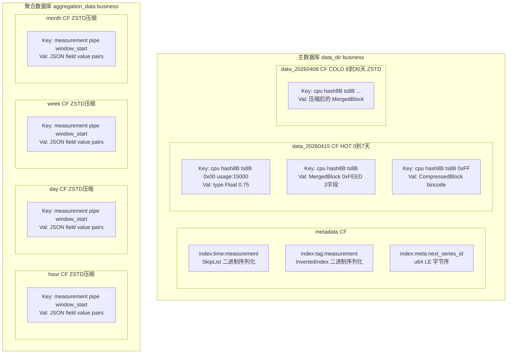

---

## 11. 协议 V2 编解码时序图 (Protocol V2 Sequence)

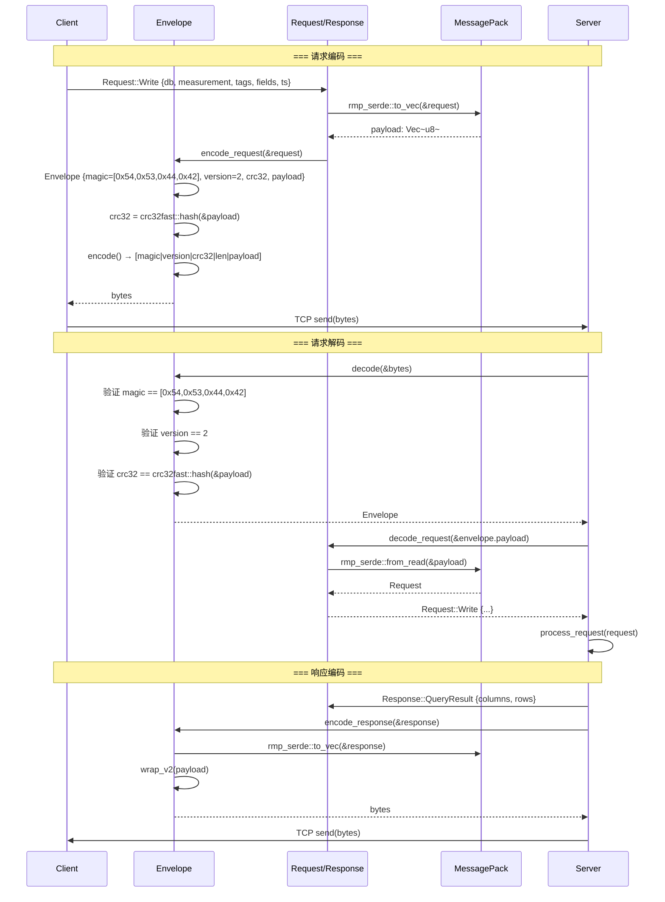

---

## 12. 索引查询流程图 (Index Query Flow)

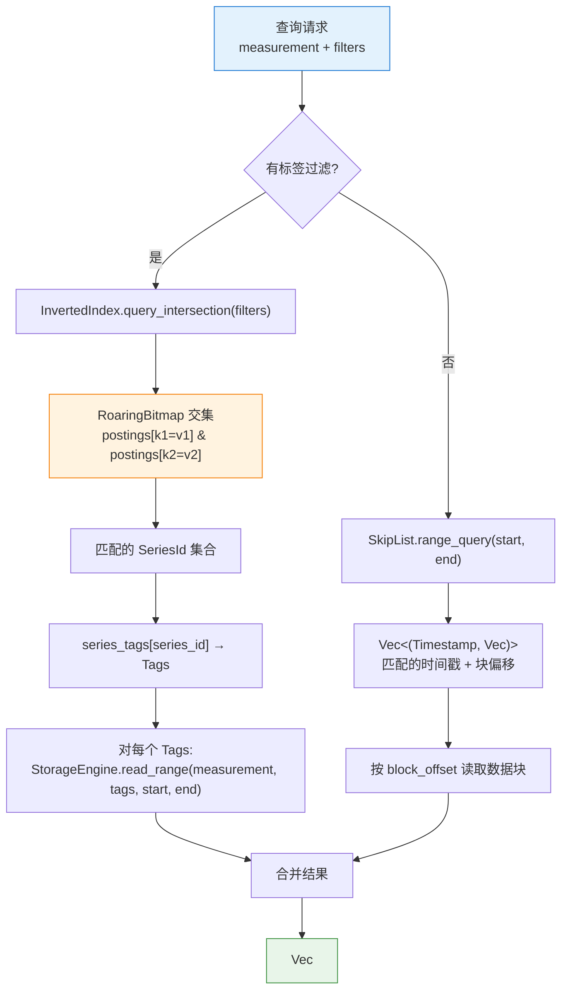

---

## 13. 压缩算法分派图 (Compression Dispatch)

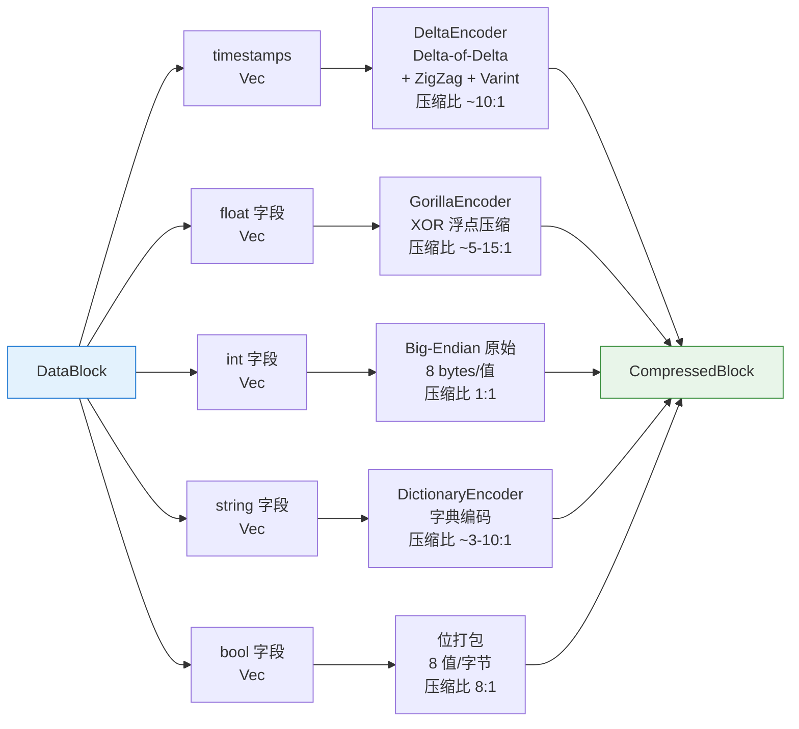
